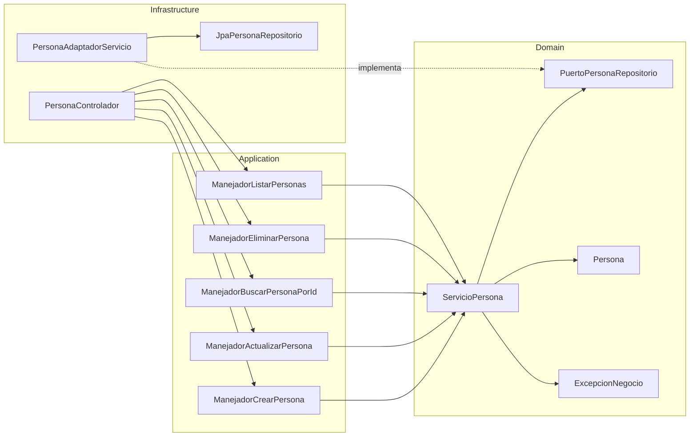

## Diagrama de Arquitectura

```mermaid
graph LR

subgraph Infrastructure
A[PersonaControlador]
B[PersonaAdaptadorServicio]
C[JpaPersonaRepositorio]
end

subgraph Application
D[ManejadorCrearPersona]
E[ManejadorActualizarPersona]
F[ManejadorBuscarPersonaPorId]
G[ManejadorEliminarPersona]
H[ManejadorListarPersonas]
end

subgraph Domain
I[ServicioPersona]
J[PuertoPersonaRepositorio]
K[Persona]
L[ExcepcionNegocio]
end

A --> D
A --> E
A --> F
A --> G
A --> H

D --> I
E --> I
F --> I
G --> I
H --> I

I --> J

B -. implementa .-> J

B --> C

I --> K
I --> L
```